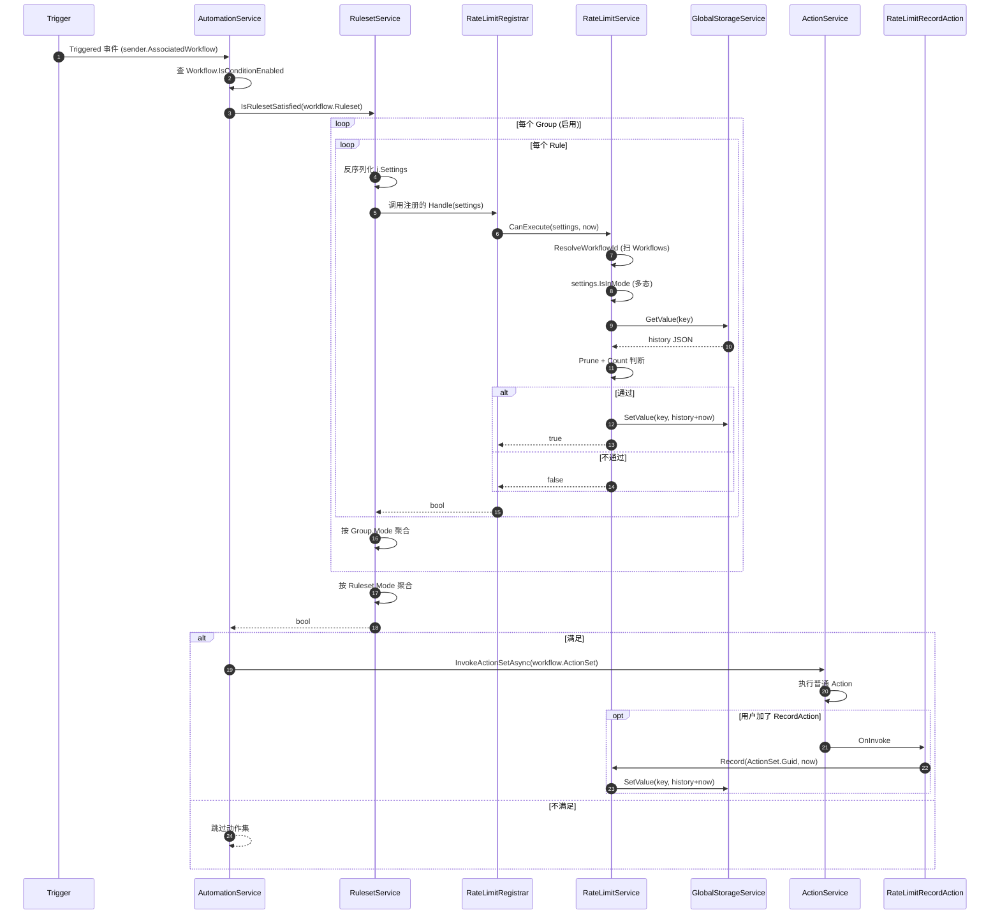
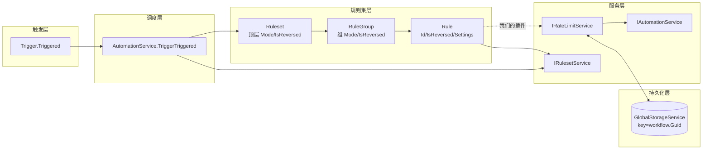

# ClassIsland 规则集 + 限频插件 运作流程图

## 完整流程（触发 → 规则集 → 限频 → 行动）

```mermaid
flowchart TD
    Start([触发器事件<br/>例：上课、窗口切换]) --> AS_Trigger{AutomationService<br/>接收事件}

    AS_Trigger --> GetWf[获取 trigger.AssociatedWorkflow<br/>拿到 Workflow 实例]

    GetWf --> CheckEnabled{Workflow.IsConditionEnabled<br/>条件检查是否启用?}

    CheckEnabled -- 否 --> SkipWf([跳过该工作流])
    CheckEnabled -- 是 --> CallEval[调用<br/>RulesetService.IsRulesetSatisfied<br/>workflow.Ruleset]

    CallEval --> RS_TopMode{Ruleset.Mode<br/>顶层 AND/OR?}

    RS_TopMode --> GrpLoop[遍历 Ruleset.Groups<br/>仅 IsEnabled=true 的组]

    GrpLoop --> GrpMode{每组 Group.Mode<br/>AND/OR?}
    GrpMode --> RuleLoop[遍历 Group.Rules]

    RuleLoop --> CheckEmpty{Rule.Id 是否<br/>已注册?}
    CheckEmpty -- 否 --> RuleFalse[Rule 视为<br/>不满足 false]
    CheckEmpty -- 是 --> Deserialize[反序列化 settings<br/>i.Settings → 强类型]

    Deserialize --> CallHandle[调用<br/>rule.Handle settings]

    CallHandle --> RL_CanExec[RateLimitRuleRegistrar.Handle<br/>→ IRateLimitService.CanExecute]

    RL_CanExec --> ResolveId{RateLimitSettings<br/>CachedWorkflowId<br/>有缓存?}
    ResolveId -- 无 --> ScanWf[遍历<br/>IAutomationService.Workflows<br/>ReferenceEquals 找 settings]
    ScanWf --> CacheIt[写入 settings.CachedWorkflowId]
    CacheId[返回 workflow.ActionSet.Guid]
    ResolveId -- 有 --> CacheId
    CacheIt --> CacheId

    CacheId --> ModeCheck{settings.IsInMode<br/>多态分发}
    ModeCheck -- 模式不符 --> ModeFalse([false])
    ModeCheck -- 模式符合 --> LoadHist[LoadHistory workflowId<br/>从 GlobalStorageService 读]

    LoadHist --> Prune[PruneOldEntries<br/>弹掉 now-windowSeconds 之前的]

    Prune --> CountCheck{history.Count<br/>&lt; MaxCount?}

    CountCheck -- 超过 --> CountFalse([false])
    CountCheck -- 未超 --> AppendHist[history.Add now<br/>SaveHistory 写回]

    AppendHist --> ReturnTrue([true])

    ReturnTrue --> GrpAgg[Group 内按 Group.Mode<br/>合取/析取所有 Rule 结果]
    CountFalse --> GrpAgg
    ModeFalse --> GrpAgg
    RuleFalse --> GrpAgg

    GrpAgg --> GrpResult{Group 整体<br/>满足?}

    GrpResult --> ReverseGrp{Group.IsReversed<br/>是否取反?}
    ReverseGrp -- 是 --> GrpNot[结果取反]
    ReverseGrp -- 否 --> GrpOut[结果保持]
    GrpNot --> GrpOut

    GrpOut --> TopAgg[顶层按 Ruleset.Mode<br/>合取/析取所有 Group 结果]

    TopAgg --> ReverseTop{Ruleset.IsReversed<br/>是否取反?}
    ReverseTop -- 是 --> TopNot[结果取反]
    ReverseTop -- 否 --> TopOut[结果保持]
    TopNot --> TopOut

    TopOut --> FinalResult{最终结果<br/>满足?}

    FinalResult -- false --> SkipAction([跳过动作集])
    FinalResult -- true --> RunAction[调用 ActionService<br/>InvokeActionSetAsync]

    RunAction --> ActionLoop[按顺序执行<br/>ActionSet.Actions]

    ActionLoop --> HasRecord{用户加了<br/>RateLimitRecordAction?}

    HasRecord -- 是 --> DoRecord[RateLimitRecordAction.OnInvoke<br/>→ IRateLimitService.Record<br/>ActionSet.Guid]
    DoRecord --> SaveHist2[history.Add now<br/>SaveHistory 写回]
    SaveHist2 --> MoreActions{还有<br/>其他行动?}

    HasRecord -- 否 --> MoreActions

    MoreActions -- 是 --> ActionLoop
    MoreActions -- 否 --> Done([工作流执行完毕])

    SkipAction --> Done

    %% 持久化细节
    subgraph PERSIST [GlobalStorageService 持久化层]
        Key[(key =<br/>classisland.ratelimit.history.<br/>workflow.Guid)]
        Val[List&lt;DateTime&gt; JSON]
    end

    LoadHist -.读.-> Key
    AppendHist -.写.-> Key
    Key -.反序列化.-> Val
```

## 类间时序图（核心交互）

```mermaid
sequenceDiagram
    autonumber
    participant Trg as Trigger
    participant AS as AutomationService
    participant RS as RulesetService
    participant RR as RateLimitRegistrar
    participant Svc as RateLimitService
    participant Store as GlobalStorageService
    participant AC as ActionService
    participant Rec as RateLimitRecordAction

    Trg->>AS: Triggered 事件 (sender.AssociatedWorkflow)
    AS->>AS: 查 Workflow.IsConditionEnabled
    AS->>RS: IsRulesetSatisfied(workflow.Ruleset)

    loop 每个 Group (启用)
        loop 每个 Rule
            RS->>RS: 反序列化 i.Settings
            RS->>RR: 调用注册的 Handle(settings)
            RR->>Svc: CanExecute(settings, now)

            Svc->>Svc: ResolveWorkflowId (扫 Workflows)
            Svc->>Svc: settings.IsInMode (多态)
            Svc->>Store: GetValue(key)
            Store-->>Svc: history JSON
            Svc->>Svc: Prune + Count 判断

            alt 通过
                Svc->>Store: SetValue(key, history+now)
                Svc-->>RR: true
            else 不通过
                Svc-->>RR: false
            end
            RR-->>RS: bool
        end
        RS->>RS: 按 Group.Mode 聚合
    end
    RS->>RS: 按 Ruleset.Mode 聚合
    RS-->>AS: bool

    alt 满足
        AS->>AC: InvokeActionSetAsync(workflow.ActionSet)
        AC->>AC: 执行普通 Action
        opt 用户加了 RecordAction
            AC->>Rec: OnInvoke
            Rec->>Svc: Record(ActionSet.Guid, now)
            Svc->>Store: SetValue(key, history+now)
        end
    else 不满足
        AS-->>AS: 跳过动作集
    end
```

## 数据流层级（自上而下）

```mermaid
flowchart LR
    subgraph 触发层
        T1[Trigger.Triggered]
    end

    subgraph 调度层
        A1[AutomationService.TriggerTriggered]
    end

    subgraph 规则集层
        R1[Ruleset<br/>顶层 Mode/IsReversed]
        R2[RuleGroup<br/>组 Mode/IsReversed]
        R3[Rule<br/>Id/IsReversed/Settings]
    end

    subgraph 服务层
        S1[IRateLimitService]
        S2[IRulesetService]
        S3[IAutomationService]
    end

    subgraph 持久化层
        P1[(GlobalStorageService<br/>key=workflow.Guid)]
    end

    T1 --> A1
    A1 --> R1
    R1 --> R2
    R2 --> R3
    R3 --> S2
    R3 -.我们的插件.-> S1
    S1 --> S3
    S1 <--> P1
    A1 --> S2
```
